<div align="center">

# 📄 DocChat

**Chat with your documents using AI — upload PDFs, ask questions, get cited answers.**

[](https://nextjs.org)
[](https://expo.dev)
[](https://supabase.com)
[](https://groq.com)
[](LICENSE)

[Web App](#) · [Report Bug](issues) · [Request Feature](issues)

</div>

---

## ✨ What is DocChat?

DocChat is a full-stack AI application that lets you **upload PDF documents and have conversations with them**. Ask questions in plain English and get accurate, cited answers pulled directly from your documents — available on both web and mobile.

---

## 📸 Screenshots

### Web App

| Landing                                        | Login                                   |
| ---------------------------------------------- | --------------------------------------- |
| 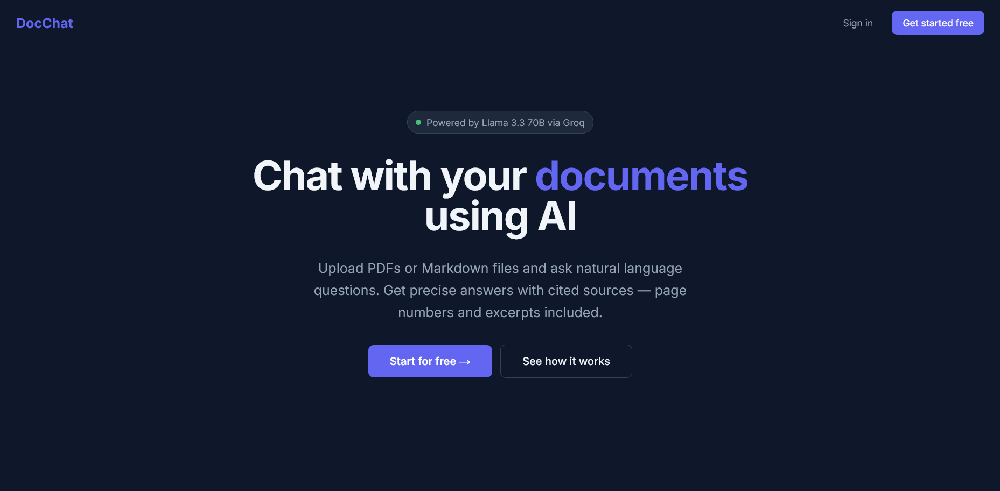 | 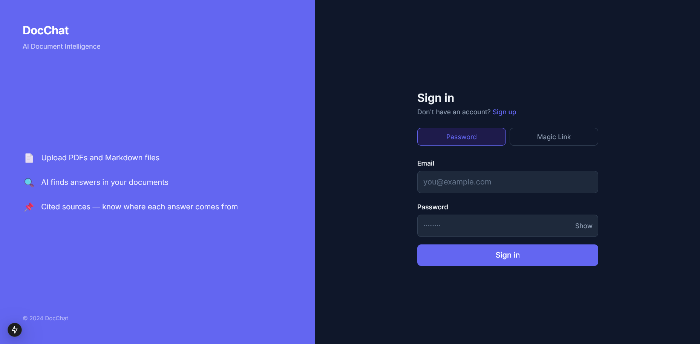 |

| Dashboard                                        | Chat Interface                         |
| ------------------------------------------------ | -------------------------------------- |
| 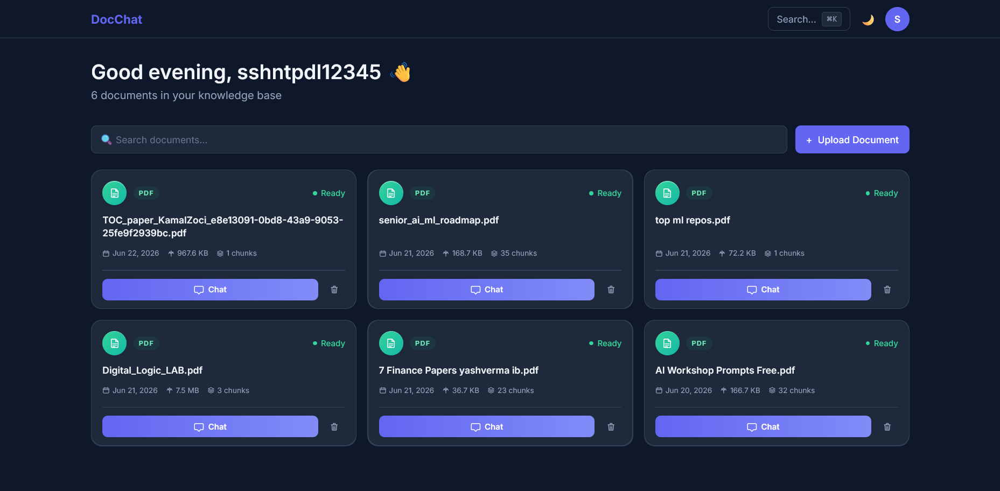 | 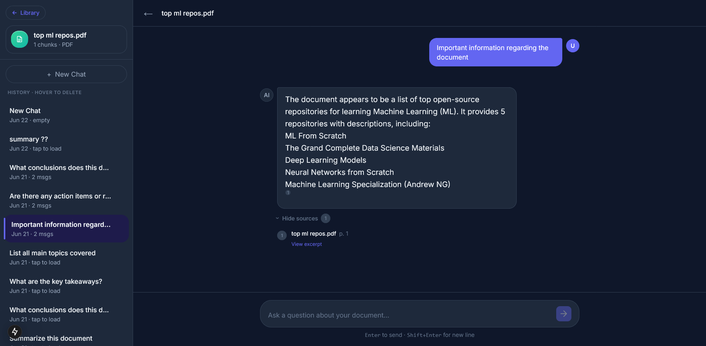 |

| Upload Flow |
| ----------- |

| 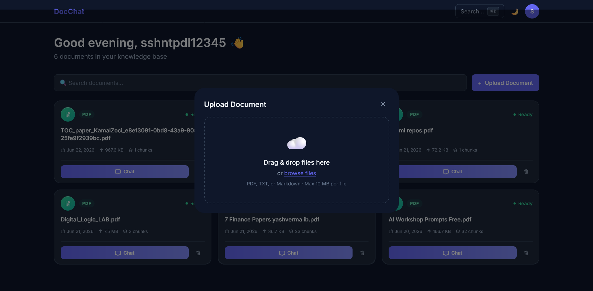

### Mobile App (React Native)

| Login                                                            | Dashboard                                              | Chat                                              |
| ---------------------------------------------------------------- | ------------------------------------------------------ | ------------------------------------------------- |
| 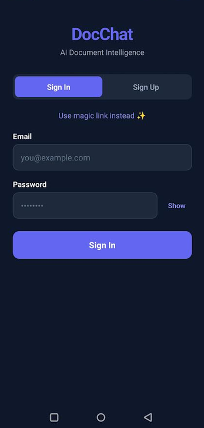                      | 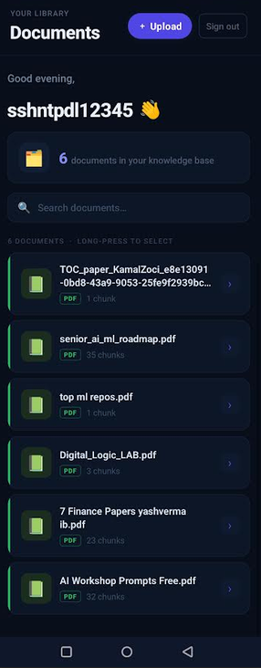    | 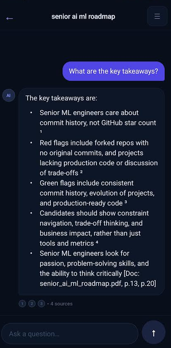         |
| Upload Document                                                  | Upload Tracker                                         | New Chat                                          |
| --------------------------------------                           | -----------------------------------------              | ------------------------------------              |
| 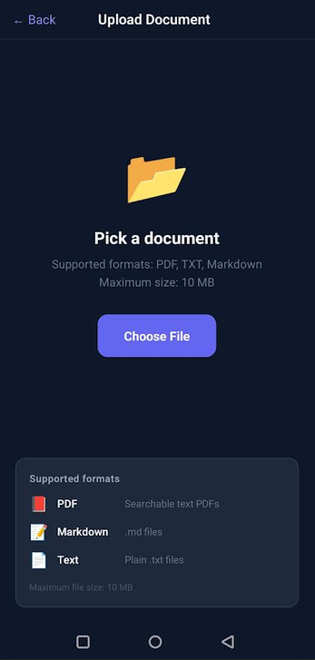           | 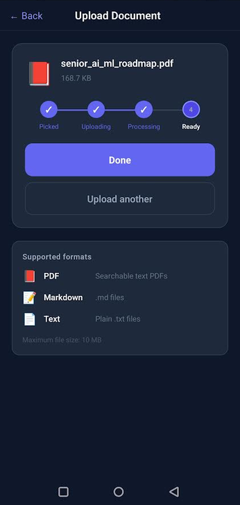 | 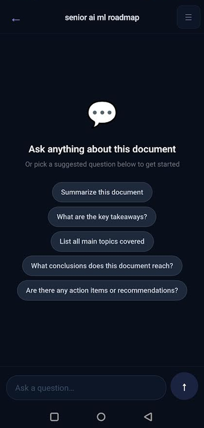 |
| Mobile Chat Sidebar                                              |
| --------------------------------------                           |
| 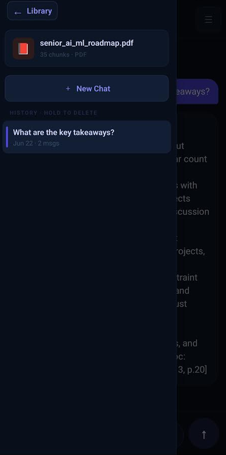 |

---

## 🔄 User Flow

```
1. Sign up / Log in
        │
        ▼
2. Upload a PDF (drag & drop on web, file picker on mobile)
        │
        ▼
3. Wait ~5–15 seconds while the document is processed
   (chunked → embedded → stored in pgvector)
        │
        ▼
4. Open the chat for your document
        │
        ▼
5. Ask any question in plain English
        │
        ▼
6. Get a streaming AI response with source citations
   showing exactly which part of your document it came from
```

---

## 🛠️ Tech Stack

### Frontend — Web

| Layer     | Technology                                                                |
| --------- | ------------------------------------------------------------------------- |
| Framework | [Next.js 15](https://nextjs.org) (App Router, Server + Client Components) |
| Styling   | Tailwind CSS                                                              |
| State     | Zustand                                                                   |

### Frontend — Mobile

| Layer      | Technology              |
| ---------- | ----------------------- |
| Framework  | Expo SDK + React Native |
| Navigation | Expo Router             |

### Backend (Next.js Route Handlers)

| Layer        | Technology                                                                    |
| ------------ | ----------------------------------------------------------------------------- |
| AI / LLM     | [Groq API](https://groq.com) — LLaMA 3.3 70B (free tier)                      |
| Embeddings   | [HuggingFace](https://huggingface.co) — all-MiniLM-L6-v2 (384-dim, free tier) |
| RAG pipeline | LangChain.js                                                                  |
| Streaming    | Server-Sent Events (SSE)                                                      |

### Infrastructure

| Layer    | Technology                                               |
| -------- | -------------------------------------------------------- |
| Database | [Supabase](https://supabase.com) — PostgreSQL + pgvector |
| Auth     | Supabase Auth (Email/Password + Magic Link)              |
| Monorepo | Turborepo + npm workspaces                               |

---

## 🚀 Running Locally

### Prerequisites

- Node.js 20+
- npm 10+
- A free [Supabase](https://supabase.com) account
- A free [Groq](https://console.groq.com) account
- A free [HuggingFace](https://huggingface.co) account

---

### 1. Clone and install

```bash
git clone https://github.com/sshntpdl/doc-chat.git
cd docchat
npm install
```

---

### 2. Set up Supabase

1. Create a new project at [supabase.com](https://supabase.com)
2. Go to **Settings → API** and copy your **Project URL** and **anon key**
3. In the SQL Editor, run the schema:
   - Open **SQL Editor → New Query**
   - Paste the contents of `/packages/supabase/schema.sql`
   - Click **Run**
4. Go to **Authentication → URL Configuration** and set:
   - Site URL: `http://localhost:3000`
   - Redirect URLs: `http://localhost:3000/auth/callback`

---

### 3. Get your API keys

**Groq (LLM)**

1. Sign up at [console.groq.com](https://console.groq.com)
2. Go to **API Keys → Create API Key**
3. Copy the `gsk_...` key

**HuggingFace (Embeddings)**

1. Go to [huggingface.co/settings/tokens](https://huggingface.co/settings/tokens)
2. Create a new token with **Inference** type
3. Copy the `hf_...` key

---

### 4. Configure environment variables

```bash
cp apps/web/.env.example apps/web/.env.local
cp apps/mobile/.env.example apps/mobile/.env
```

Open each file and fill in the values:

```env
# apps/web/.env.local
NEXT_PUBLIC_SUPABASE_URL=your_supabase_project_url
NEXT_PUBLIC_SUPABASE_ANON_KEY=your_supabase_anon_key
GROQ_API_KEY=gsk_...
HUGGINGFACE_API_KEY=hf_...
```

```env
# apps/mobile/.env
EXPO_PUBLIC_SUPABASE_URL=your_supabase_project_url
EXPO_PUBLIC_SUPABASE_ANON_KEY=your_supabase_anon_key
EXPO_PUBLIC_API_URL=http://localhost:3000
```

---

### 5. Start the web app

```bash
npm run dev
```

Open [http://localhost:3000](http://localhost:3000)

---

### 6. Start the mobile app

```bash
cd apps/mobile
npx expo start
```

- Press `i` for iOS Simulator
- Press `a` for Android Emulator
- Scan the QR code with the **Expo Go** app on your phone

> **On a physical device?** Change `EXPO_PUBLIC_API_URL` in `.env` from `localhost:3000` to your machine's local IP address (e.g. `192.168.1.5:3000`).

---

## 📁 Project Structure

```
docchat/
├── package.json              # Workspace root (npm workspaces)
├── turbo.json                # Turborepo pipeline config
├── tsconfig.base.json        # Shared TS config
│
├── packages/
│   ├── types/                # Shared TypeScript types
│   │   └── src/index.ts      # AppError, Document, ChatMessage, SSEEvent
│   │
│   ├── supabase/             # Supabase client factories
│   │   ├── src/client.ts     # createBrowserClient / createServerClient
│   │   ├── src/middleware.ts # updateSession() for Next.js middleware
│   │   └── schema.sql        # Complete DB schema + RLS + pgvector function
│   │
│   └── stores/               # Zustand stores (shared web + mobile)
│       └── src/
│           ├── authStore.ts  # Session, sign in/out, onAuthStateChange
│           ├── documentStore.ts # Upload queue, XHR progress, polling
│           ├── chatStore.ts  # SSE streaming, appendToken, useShallow
│           ├── uiStore.ts    # Theme, toasts, sidebar, modals
│           └── index.ts      # Barrel export
│
├── apps/
│   ├── web/                  # Next.js 15 application
│   │   ├── next.config.ts
│   │   ├── middleware.ts     # Route protection + session refresh
│   │   ├── .env.example
│   │   └── app/
│   │       ├── layout.tsx    # Root layout: StoreInitializer + ToastContainer
│   │       ├── globals.css   # CSS custom properties (design tokens)
│   │       │
│   │       ├── auth/
│   │       │   ├── login/page.tsx      # Email/password + magic link
│   │       │   └── callback/page.tsx   # Supabase auth redirect handler
│   │       │
│   │       ├── dashboard/
│   │       │   └── page.tsx  # Server Component: fetch docs server-side
│   │       │
│   │       ├── chat/[documentId]/
│   │       │   └── page.tsx  # Two-column chat: sidebar + streaming chat
│   │       │
│   │       └── api/
│   │           ├── _lib/
│   │           │   ├── auth.ts      # getAuthenticatedUser (cookie+header)
│   │           │   ├── response.ts  # successResponse/errorResponse/streamResponse
│   │           │   ├── ratelimit.ts # Token bucket Map-based rate limiter
│   │           │   └── langchain.ts # Groq + HF singletons, retrieveChunks
│   │           │
│   │           ├── ingest/route.ts          # POST: PDF→chunk→embed→store
│   │           ├── documents/route.ts       # GET: list documents
│   │           ├── documents/[id]/route.ts  # GET/DELETE: single document
│   │           ├── chat/route.ts            # POST: SSE RAG streaming
│   │           └── chat/history/[id]/route.ts # GET/DELETE: session history
│   │
│   │   └── components/
│   │       ├── providers/StoreInitializer.tsx  # Bootstraps auth on mount
│   │       ├── dashboard/
│   │       │   ├── DashboardNav.tsx    # Top nav: logo, ⌘K, theme, avatar
│   │       │   ├── DocumentGrid.tsx    # Search + grid + upload trigger
│   │       │   └── DocumentCard.tsx    # Hover actions, status badge, confirm delete
│   │       ├── upload/UploadZone.tsx   # react-dropzone + XHR progress
│   │       ├── chat/
│   │       │   ├── MessageBubble.tsx   # User/AI bubbles, react-markdown, copy
│   │       │   └── SourceCitation.tsx  # Collapsible citations, similarity meter
│   │       └── ui/ToastContainer.tsx   # Global toast system, auto-dismiss
│   │
│   └── mobile/               # Expo SDK 51 + React Native
│       ├── app.json          # Expo config: deep links, permissions
│       ├── .env.example
│       └── app/
│           ├── _layout.tsx       # Root: auth init, deep links, offline banner
│           ├── auth/
│           │   ├── _layout.tsx   # Auth group stack
│           │   └── login.tsx     # Email/password + magic link (KeyboardAvoidingView)
│           ├── documents/
│           │   ├── _layout.tsx   # Tab layout
│           │   └── index.tsx     # FlatList + swipe + long-press multi-select
│           └── chat/
│               └── [documentId].tsx  # SSE chat (react-native-sse) + haptics
```

---

## 🤝 Contributing

Pull requests are welcome! For major changes, please open an issue first to discuss what you'd like to change.

---

## 📄 License

[MIT](LICENSE)

---

<div align="center">
Made with ☕ and too many embeddings
</div>
